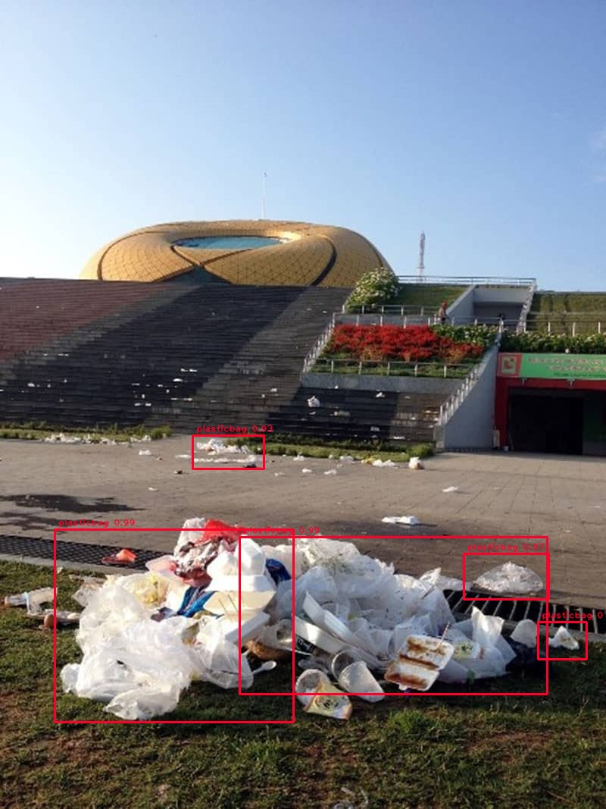
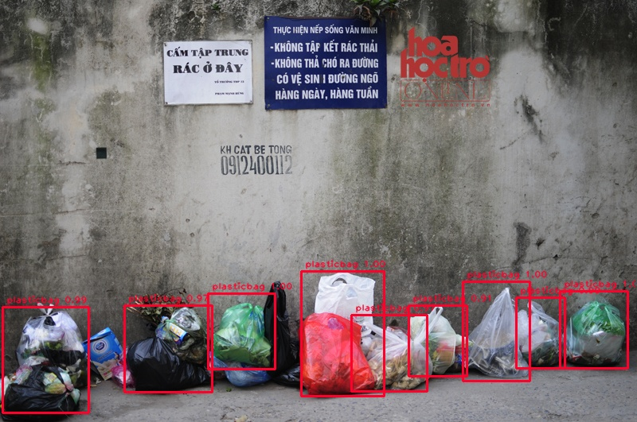
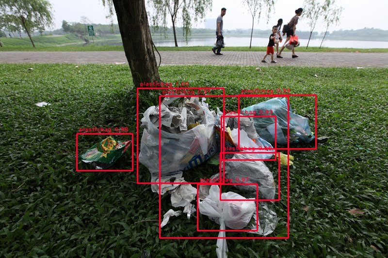

# plasticbag-faster-rcnn

This fork is a Tensorflow implementation of Faster RCNN, which aims to accurately detect plastic bags on streets in Vietnam. I conducted the project during my time as an intern at [VinAI Research Lab](https://www.vinai.io/).

**Note**: The fork is mostly based on the implementation of [tf-faster-rcnn](https://github.com/endernewton/tf-faster-rcnn). If you have any problems running the code, please refer to [Issues](https://github.com/endernewton/tf-faster-rcnn/issues) in the original repository first. Also, check out the technical report [An Implementation of Faster RCNN with Study for Region Sampling](https://arxiv.org/pdf/1702.02138.pdf) if needed. For details about the faster RCNN architecture, please refer to [Faster R-CNN: Towards Real-Time Object Detection with Region Proposal Networks](https://arxiv.org/pdf/1506.01497.pdf).

My work integrates the **PASCAL VOC 2007+2012 dataset** with the customized **PlasticVNOI** dataset (which stands for _**Plastic**bags in **V**iet**n**am + **O**penImages + **I**mageNet_). This dataset utilized a lot of images from the well-known _OpenImages_ and _ImageNet_ datasets. The remaining images were collected from different online sources in Vietnam. They were all taken on many polluted streets across the country. Most of the unannotated images were annotated manually, while the others were machine-annotated and human-verified. At the moment, the **PlasticVNOI** dataset contains over 1000 images with annotations.

## Detection Performance

The current code supports **VGG16**, **Resnet V1** and **Mobilenet V1** models. I mainly tested on the Resnet architecture as it seemed to be the best for Faster RCNN compared to the others. The model for plastic bag detection performs very accurately in high resolution images and closed objects.

* With VGG16, AP for plasticbag = *52.24*.
* With Resnet101, AP for plasticbag = *62.04*.

**Some of the results:**
(`plasticbag` only)





## Prerequisites

Please follow the instructions in [the original repository](https://github.com/endernewton/tf-faster-rcnn#prerequisites) to install all prerequisites.

## Installation

1. Clone the repository

```Shell
git clone https://github.com/ngthanhvinh/plasticbag-faster-rcnn.git
```

2. Update your -arch in setup script to match your GPU

```Shell
cd plasticbag-faster-rcnn/lib
# Change the GPU architecture (-arch) if necessary
vim setup.py
```

| GPU model                  | Architecture |
| -------------------------- | ------------ |
| TitanX (Maxwell/Pascal)    | sm_52        |
| GTX 960M                   | sm_50        |
| GTX 1080 (Ti)              | sm_61        |
| Grid K520 (AWS g2.2xlarge) | sm_30        |
| Tesla K80 (AWS p2.xlarge)  | sm_37        |

**Note**: You are welcome to contribute the settings on your end if you have made the code work properly on other GPUs. Also even if you are only using CPU tensorflow, GPU based code (for NMS) will be used by default, so please set **USE_GPU_NMS False** to get the correct output.

3. Build the Cython modules

```Shell
make clean
make
cd ..
```

## Setup data

### Setup the PASCAL VOC 2007+2012

Please follow the instructions below to setup the VOC2007 dataset

1. Download the training, validation, test data and VOCdevkit

```Shell
wget http://host.robots.ox.ac.uk/pascal/VOC/voc2007/VOCtrainval_06-Nov-2007.tar
wget http://host.robots.ox.ac.uk/pascal/VOC/voc2007/VOCtest_06-Nov-2007.tar
wget http://host.robots.ox.ac.uk/pascal/VOC/voc2007/VOCdevkit_08-Jun-2007.tar
```

2. Extract all of these tars into one directory named `VOCdevkit`

```Shell
tar xvf VOCtrainval_06-Nov-2007.tar
tar xvf VOCtest_06-Nov-2007.tar
tar xvf VOCdevkit_08-Jun-2007.tar
```

3. It should have this basic structure

```Shell
VOCdevkit/                           # development kit
VOCdevkit/VOCcode/                   # VOC utility code
VOCdevkit/VOC2007                    # image sets, annotations, etc.
# ... and several other directories ...
```

4. Rename the directory to `VOCdevkit2007`

```Shell
mv VOCdevkit VOCdevkit2007
```

5. Create a symlink for the PASCAL VOC 2007 dataset

```Shell
cd data
ln -s ../VOCdevkit2007 VOCdevkit2007
```

After setting up the `VOCdevkit2007`, repeat the similar process to set up `VOCdevkit2012`. Some useful links:

- To download the training/validation data: http://host.robots.ox.ac.uk/pascal/VOC/voc2012/VOCtrainval_11-May-2012.tar
- To download the development kit code and documentation: http://host.robots.ox.ac.uk/pascal/VOC/voc2012/VOCdevkit_18-May-2011.tar

**Note**:

- You only have to take the two links above into account because you would use `voc_2007_trainval` or `voc2007_trainval+voc2012trainval` to train/validate the model and `voc2007_test` to test the result.
- After downloading the train/val data and the devkit, remember to move the `VOC2012` folder of train/val data into the devkit folder.
- The devkit folder should be placed in the repository root. In addition, remember to name it `VOCdevkit2012` and create a symlink for the PASCAL VOC 2012 dataset in `data`.
- Finally, the `VOCdevkit2012` folder should have the exact same structure as the `VOCdevkit2007` folder.

### Setup the custom dataset for plasticbags (PlasticVNOI) and integrate it with the PASCAL VOC dataset

Download the **PlasticVNOI** dataset [here](https://drive.google.com/open?id=1U-l6YMzqLN0_eq91l17buxnRJzkdWQyV), and then save it into the `plasticbag_dataset` folder.

Then, extract the dataset

```Shell
cd plasticbag_dataset
tar xvf plasticVNOI.tar.xz
cd ..
```

After that, the `plasticbag_dataset` folder should have the following structure:

```Shell
/plasticbag_dataset
  /annotations
    0a553ce06f26e637.xml
    00a76046606aa888.xml
    ...
  /images
    0a553ce06f26e637.jpg
    00a76046606aa888.jpg
    ...
  integrate_pascal_voc.py
```

The integration process of **PlasticVNOI** and **Pascal VOC** would add, remove, and rewrite a bunch of files in `VOCdevkit2007/VOC2007` folder so that it fits both the original and the custom datasets. In order not to mess everything up, it is best to backup the `VOC2007` data first:

```Shell
cd VOCdevkit2007
cp VOC2007 VOC2007_backup
cd ..
```

Finally, run:

```Shell
cd plasticbag_dataset
python3 integrate_pascal_voc.py
cd ..
```

Now, the **PlasticVNOI** dataset is integrated into `VOCdevkit2007/VOC2007` folder. You may want to checkout the folder to understand what happened.

## Demo and Test with pre-trained models

1. Download pre-trained model

You can download the pre-trained model [here](https://drive.google.com/open?id=1BgFAsSM8oyybCSf4e4kk0JWU60dvDpwE). Save it into the `data` folder.

2. Extract the downloaded model

```Shell
cd data
tar xvf voc_0712_80k-200k.tar.xz
cd ..
```

3. Create a folder and a soft link to use the pre-trained model

```Shell
NET=res101
TRAIN_IMDB=voc_2007_trainval+voc_2012_trainval
mkdir -p output/${NET}/${TRAIN_IMDB}
cd output/${NET}/${TRAIN_IMDB}
ln -s ../../../data/voc_2007_trainval+voc_2012_trainval ./default
cd ../../..
```

4. Demo for testing on custom images

```Shell
# at repository root
GPU_ID=0
CUDA_VISIBLE_DEVICES=${GPU_ID} python3 tools/demo.py
```

**Note**: Resnet101 testing probably requires several gigabytes of memory, so if you encounter memory capacity issues, please install it with CPU support only. Refer to [Issue 25](https://github.com/endernewton/tf-faster-rcnn/issues/25) in the original repository.

5. Test with pre-trained Resnet101 models

```Shell
GPU_ID=0
./experiments/scripts/test_faster_rcnn.sh $GPU_ID pascal_voc_0712 res101
```

## Train your own model

1. Download pre-trained models and weights. The current code support VGG16 and Resnet V1 models. Pre-trained models are provided by slim, you can get the pre-trained models [here](https://github.com/tensorflow/models/tree/master/research/slim#pre-trained-models) and set them in the `data/imagenet_weights` folder. For example for VGG16 model, you can set up like:

   ```Shell
   mkdir -p data/imagenet_weights
   cd data/imagenet_weights
   wget -v http://download.tensorflow.org/models/vgg_16_2016_08_28.tar.gz
   tar -xzvf vgg_16_2016_08_28.tar.gz
   mv vgg_16.ckpt vgg16.ckpt
   cd ../..
   ```

   For Resnet101, you can set up like:

   ```Shell
   mkdir -p data/imagenet_weights
   cd data/imagenet_weights
   wget -v http://download.tensorflow.org/models/resnet_v1_101_2016_08_28.tar.gz
   tar -xzvf resnet_v1_101_2016_08_28.tar.gz
   mv resnet_v1_101.ckpt res101.ckpt
   cd ../..
   ```

2. Train (and test, evaluation)

```Shell
./experiments/scripts/train_faster_rcnn.sh [GPU_ID] [DATASET] [NET]
# GPU_ID is the GPU you want to test on
# NET in {vgg16, res50, res101, res152} is the network arch to use
# DATASET {pascal_voc, pascal_voc_0712} is defined in train_faster_rcnn.sh. {coco} has not been supported yet.
# Examples:
./experiments/scripts/train_faster_rcnn.sh 0 pascal_voc vgg16
./experiments/scripts/train_faster_rcnn.sh 1 pascal_voc_0712 res101
```

3. Visualization with Tensorboard

```Shell
tensorboard --logdir=tensorboard/vgg16/voc_2007_trainval+voc_2012_trainval/ --port=7001 &
```

4. Test and evaluate

```Shell
./experiments/scripts/test_faster_rcnn.sh [GPU_ID] [DATASET] [NET]
# GPU_ID is the GPU you want to test on
# NET in {vgg16, res50, res101, res152} is the network arch to use
# DATASET {pascal_voc, pascal_voc_0712} is defined in test_faster_rcnn.sh. {coco} has not been supported yet.
# Examples:
./experiments/scripts/test_faster_rcnn.sh 0 pascal_voc vgg16
./experiments/scripts/test_faster_rcnn.sh 1 pascal_voc_0712 res101
```

5. You can use `tools/reval.sh` for re-evaluation

By default, trained networks are saved under:

```
output/[NET]/[DATASET]/default/
```

Test outputs are saved under:

```
output/[NET]/[DATASET]/default/[SNAPSHOT]/
```

Tensorboard information for train and validation is saved under:

```
tensorboard/[NET]/[DATASET]/default/
tensorboard/[NET]/[DATASET]/default_val/
```

## Scope of Improvement

- [x] Python3 adaption
- [x] Save every snapshot during the training process
- [x] PASCAL VOC 2007 integration
- [x] PASCAL VOC 2007+2012 integration
- [ ] COCO integration
- [ ] Collect more data with annotations for plastic bags
